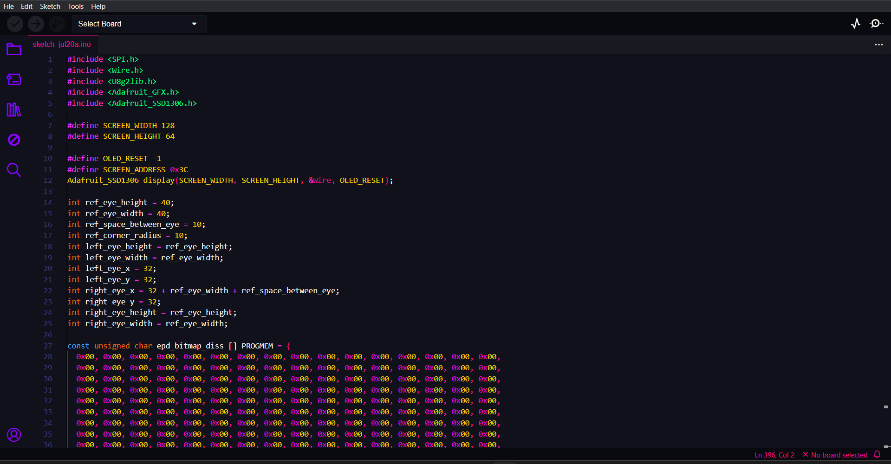
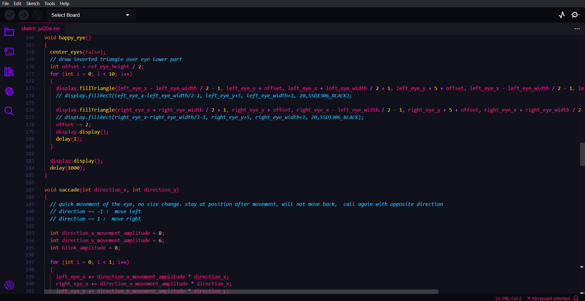

# Blossom Theme for Arduino IDE
## Preview 



## Installation v2.X
1. Clone the Github Repository
```git clone https://github.com/BlossomTheme/Arduino-IDE.git```

2. Copy the ```blossom``` directory to ```~/.arduinoIDE/plugins``` (if the directory doesn't exist, create it)
```cp -r ./blossom/* ~/.arduinoIDE/plugins/```

3. Open arduino

4. Go to File > Preference > Themes

5. Select Blossom
